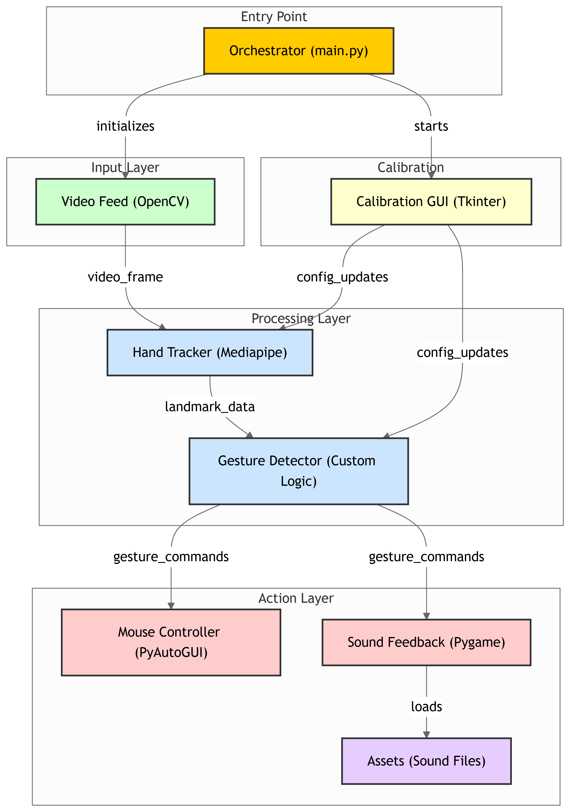

# Virtual Mouse dengan Deteksi Tangan

Proyek ini memungkinkan Anda mengontrol kursor mouse komputer menggunakan gerakan tangan yang dideteksi melalui webcam.

## Fitur Utama

*   **Gerakan Mouse:** Gerakkan tangan (dengan telunjuk terangkat) untuk menggerakkan kursor.
*   **Klik Kiri:** Pertemukan ujung ibu jari dan jari telunjuk.
*   **Klik Kanan:** Pertemukan ujung ibu jari dan jari tengah.
*   **Scroll Dinamis:** Angkat jari tengah dan jari manis, lalu gerakkan tangan ke atas/bawah untuk scroll.
*   **Drag & Drop:** Kepalkan tangan (semua jari menutup) untuk menekan tombol kiri mouse (drag), gerakkan tangan (tetap mengepal), lalu buka kepalan untuk melepas (drop).
*   **Kalibrasi Real-time:** Panel GUI terpisah untuk mengatur smoothing gerakan mouse dan threshold jarak untuk deteksi klik.
*   **Feedback Suara:** Suara untuk aksi klik dan memulai drag.

## Diagram Arsitektur



## Teknologi yang Digunakan

*   **Python 3:** Bahasa pemrograman utama.
*   **OpenCV (`opencv-python`):** Untuk menangkap dan memproses gambar dari webcam.
*   **Mediapipe:** Untuk deteksi tangan dan landmark secara real-time.
*   **PyAutoGUI:** Untuk mengontrol mouse (gerakan, klik, scroll, drag).
*   **Tkinter:** Untuk membuat panel GUI kalibrasi.
*   **Pygame:** Untuk memainkan feedback suara.
*   **NumPy:** Untuk perhitungan numerik (jarak, interpolasi).

## Setup & Instalasi

1.  **Prasyarat:**
    *   Python 3.7+ terinstal.
    *   Webcam terhubung dan berfungsi.
    *   (Opsional tapi direkomendasikan) Virtual environment.

2.  **Clone Repository (jika belum):**
    ```bash
    git clone <url-repository-anda>
    cd <nama-direktori-proyek>
    ```

3.  **(Opsional) Buat dan Aktifkan Virtual Environment:**
    ```bash
    # Windows
    python -m venv venv
    .\venv\Scripts\activate

    # macOS/Linux
    python3 -m venv venv
    source venv/bin/activate
    ```

4.  **Instal Dependensi:**
    ```bash
    pip install -r requirements.txt
    ```

5.  **Siapkan File Suara:**
    *   Buat direktori bernama `assets` di dalam direktori utama proyek.
    *   Tempatkan setidaknya dua file suara format `.wav` di dalamnya:
        *   `click.wav` (untuk feedback klik kiri/kanan)
        *   `drag_start.wav` (untuk feedback saat mulai drag)
    *   Anda bisa mencari atau membuat file suara ini sendiri.

## Cara Menjalankan

Pastikan virtual environment Anda aktif (jika menggunakan).
Jalankan skrip utama dari terminal:

```bash
python main.py
```

*   Jendela webcam akan muncul menampilkan input kamera dan landmark tangan.
*   Panel GUI "Virtual Mouse Calibration" juga akan muncul.
*   Arahkan tangan Anda ke depan kamera.
*   Gunakan gestur yang dijelaskan di bagian Fitur untuk mengontrol mouse.
*   Gunakan slider pada panel kalibrasi untuk menyesuaikan sensitivitas secara real-time.
*   Tekan tombol **'q'** di jendela webcam untuk keluar dari aplikasi.

## Struktur Proyek

```
/
|-- assets/ 
|   |-- click.wav           # File suara untuk klik
|   |-- drag_start.wav      # File suara untuk drag
|-- main.py               # Skrip utama aplikasi
|-- hand_tracker.py       # Kelas untuk deteksi tangan (Mediapipe)
|-- gesture_detector.py   # Kelas untuk deteksi gestur
|-- mouse_controller.py   # Kelas untuk kontrol mouse (PyAutoGUI)
|-- calibration_gui.py    # Kelas untuk GUI Kalibrasi (Tkinter)
|-- sound_feedback.py     # Kelas untuk feedback suara (Pygame)
|-- requirements.txt      # File dependensi Python
|-- README.md             # File ini
```

## Masalah Umum & Solusi Potensial

*   **Latency Tinggi / Gerakan Patah-patah:**
    *   **Penyebab:** Performa komputer, resolusi kamera tinggi, pemrosesan yang berat.
    *   **Solusi:**
        *   Pastikan tidak ada aplikasi berat lain berjalan.
        *   Coba turunkan resolusi kamera di `main.py` (variabel `cap_width`, `cap_height`).
        *   Optimasi kode lebih lanjut (jika memungkinkan, tapi Mediapipe sudah cukup efisien).
        *   Gunakan komputer dengan spesifikasi lebih tinggi.

*   **False Positive Gesture (Gestur Salah Terdeteksi):**
    *   **Penyebab:** Kondisi pencahayaan buruk, tangan terlalu dekat/jauh dari kamera, gerakan tangan terlalu cepat, threshold deteksi kurang pas.
    *   **Solusi:**
        *   Gunakan pencahayaan yang baik dan merata.
        *   Jaga jarak tangan yang konsisten dari kamera.
        *   Gerakkan tangan lebih perlahan dan jelas.
        *   Sesuaikan nilai `click_threshold` di `calibration_gui.py` atau nilai `fist_threshold` di `gesture_detector.py` (perlu edit kode untuk fist threshold).
        *   Tingkatkan nilai `detectionCon` dan `trackCon` di `hand_tracker.py` (inisialisasi `HandTracker`), tapi ini bisa membuat deteksi lebih sulit jika kondisi kurang ideal.

*   **Koordinat Layar Tidak Sesuai / Jangkauan Terbatas:**
    *   **Penyebab:** Mapping antara area deteksi kamera dan layar kurang pas, deadzone terlalu besar.
    *   **Solusi:**
        *   Sesuaikan nilai `deadzone` di `mouse_controller.py` (inisialisasi `MouseController`). Nilai lebih kecil memperluas area aktif tapi bisa membuat kursor 'goyang' di tepi.
        *   Perbaiki logika interpolasi (`np.interp`) di `mouse_controller.py` jika diperlukan, meskipun pendekatan saat ini cukup standar.
        *   Untuk multi-monitor, PyAutoGUI mungkin memerlukan penyesuaian atau library lain mungkin lebih cocok (seperti `pynput` yang bisa memberikan informasi monitor).

*   **Suara Tidak Terdengar:**
    *   **Penyebab:** Pygame mixer gagal inisialisasi, file suara tidak ditemukan, path salah, volume sistem rendah.
    *   **Solusi:**
        *   Periksa output terminal saat start, cari pesan error dari `SoundFeedback`.
        *   Pastikan direktori `assets` ada di lokasi yang benar (sejajar dengan `main.py`).
        *   Pastikan nama file suara (`click.wav`, `drag_start.wav`) sudah benar.
        *   Pastikan format file adalah `.wav`.
        *   Periksa volume sistem dan output audio Anda.
        *   Instal ulang `pygame` jika dicurigai ada masalah instalasi.

## Pengembangan Lanjutan (Bonus)

*   **Custom Gesture Training:** Melatih model (misal SVM/CNN) untuk mengenali gestur lebih kompleks.
*   **Preset Mode:** Tombol/pilihan di GUI untuk mengubah setelan (sensitivitas, smoothing, dll.) antara mode gaming dan produktivitas.
*   **Multi-Layar Support:** Mendeteksi layar aktif atau memungkinkan navigasi antar layar.
*   **Feedback Visual Lebih Baik:** Menampilkan ikon/indikator status yang lebih jelas di layar. 